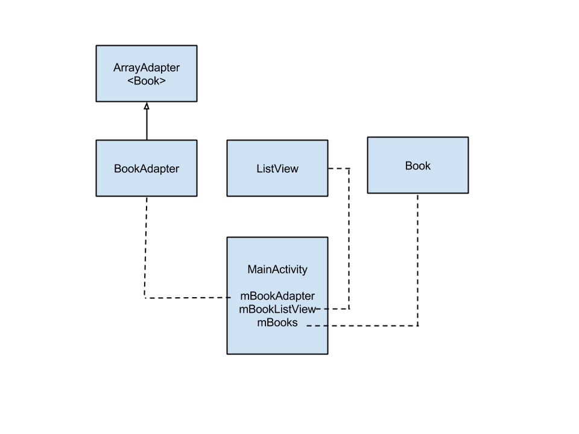

#### BookArrayAdapter
Shows how to create a custom ArrayAdapter and use it with a ListView. The data source is an ArrayList of a custom class, Book.

In a realistic application, the data source will be populated by a calling a REST endpoint.

The BookAdapter, ListView and ArrayList<Book> work together to populate the view.



##### Step 0 - Model
Create the Book class which contains information about a book.

##### Step 1 - Layout of ListView
In activity_main.xml layout file, define a listview element.

```xml
<LinearLayout xmlns:android="http://schemas.android.com/apk/res/android"
    xmlns:tools="http://schemas.android.com/tools"
    android:layout_width="match_parent"
    android:layout_height="match_parent"
    android:paddingBottom="@dimen/activity_vertical_margin"
    android:paddingLeft="@dimen/activity_horizontal_margin"
    android:paddingRight="@dimen/activity_horizontal_margin"
    android:paddingTop="@dimen/activity_vertical_margin"
    tools:context=".MainActivity">

    <ListView
        android:layout_width="match_parent"
        android:layout_height="wrap_content"
        android:id="@+id/listview" />

</LinearLayout>
```

##### Step 2 - Layout of List Item
Create the layout of an individual item in folder res -> layout -> book_row.xml. The layout will depend on the model and the information you want to show on the list.

```xml
<?xml version="1.0" encoding="utf-8"?>
<LinearLayout xmlns:android="http://schemas.android.com/apk/res/android"
    android:layout_width="match_parent"
    android:layout_height="wrap_content"
    android:padding="16dp"
    android:orientation="vertical">

    <TextView
        android:id="@+id/book_title"
        android:text="Tom Sawyer"
        android:layout_width="match_parent"
        android:layout_height="wrap_content"/>

    <TextView
        android:id="@+id/book_author"
        android:text="Mark Twain"
        android:layout_width="match_parent"
        android:layout_height="wrap_content"/>

</LinearLayout>
```

##### Step 3 - Create Custom Adapter
Extend ArrayAdapter. It mainly defines getView() method which returns the layout of the list item.

##### Step 4 - Hook up ListView, Adapter and ArrayList in Activity
Finally, in MainActivity, you need to properly wire up the model (Book), view (ListView) and controller (BookAdapter).

```java
mBooks = Book.getBooks();
mBookListView = (ListView) findViewById(R.id.listview);
mBookAdapter = new BookAdapter(this, R.layout.book_row, mBooks);
mBookListView.setAdapter(mBookAdapter);
```
