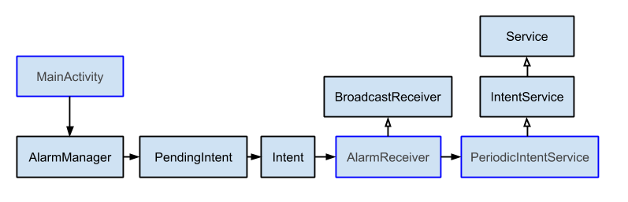

##### Periodic Service
Create a service and schedule to run it periodically. It uses AlarmManager to schedule and run a PendingIntent. The PendingIntent points to a BroadcastReceiver, which gets triggered when the alarms goes off. The BroadcastReceiver then starts an IntentService, which will do the intended work, such as check email, sync data etc.



###### 1. Create Service
Create PeriodicIntentService class, which extends IntentService. The onHandleIntent() method will be called when this service is started.

```java
public class PeriodicIntentService extends IntentService {
    public static final String TAG = PeriodicIntentService.class.getSimpleName();

    public PeriodicIntentService() {
        super("PeriodicIntentService");
    }

    @Override
    protected void onHandleIntent(Intent intent) {
        Log.d(TAG, "PeriodicIntentService running");
    }
}
```

###### 2. Create BroadcastReceiver
Define the AlarmReceiver, a sub-class of BroadcastReceiver, which will be executed by the alarm and will launch the PeriodicIntentService.

```java
public class AlarmReceiver extends BroadcastReceiver {

    public static final int REQUEST_CODE = 1;

    public AlarmReceiver() {
    }

    @Override
    public void onReceive(Context context, Intent intent) {
        Intent i = new Intent(context, PeriodicIntentService.class);
        context.startService(i);
    }
}
```

###### 3. Update Manifest
```xml
<service
    android:name=".PeriodicIntentService"
    android:exported="false" />

<receiver
    android:name=".AlarmReceiver"
    android:process=":remote" />
```

``` android:process=":remote" ``` in the ``` <receiver> ``` tag ensures that the BroadcastReceiver will continue running even when the app has been terminated.

###### 4. Schedule Alarm
Use AlarmManager to schedule a PendingIntent which has the AlarmReceiver as its Intent.

```java
public void scheduleAlarm() {

        // Create a PendingIntent to be triggered when the alarm goes off
        // The intent of this PendingIntent will execute the AlarmReceiver
        final PendingIntent pIntent = PendingIntent.getBroadcast(this,
                AlarmReceiver.REQUEST_CODE,
                new Intent(getApplicationContext(), AlarmReceiver.class),
                PendingIntent.FLAG_UPDATE_CURRENT);

        ((AlarmManager) this.getSystemService(Context.ALARM_SERVICE))
                .setInexactRepeating(AlarmManager.RTC_WAKEUP,
                        System.currentTimeMillis(),
                        REPEAT_INTERVAL,
                        pIntent);
    }
```
