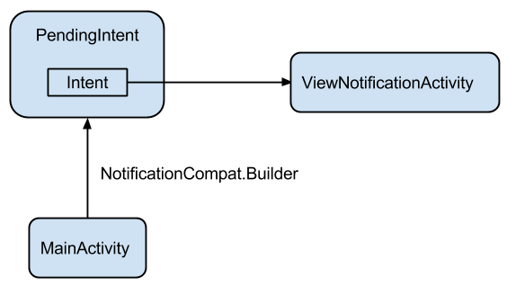

##### Simple Notification
Show how to create a notification and set up a PendingIntent to react to the notification.



###### 1. Create a PendingIntent
A PendingIntent is a deferred action that will happen when the notification is clicked.

```java
Intent intent = new Intent(this, ViewNotificationActivity.class);
PendingIntent pendingIntent = PendingIntent.getActivity(this, (int) System.currentTimeMillis(), intent, 0);
```

###### 2. Create Notification
Create the Notification using NotificationCompat.Builder.
```java
NotificationCompat.Builder notification =
    new NotificationCompat.Builder(this)
        .setColor(getApplicationContext().getResources().getColor(R.color.notification_background))
        .setContentTitle(getString(R.string.notification_title))
        .setContentText(getString(R.string.notification_content))
        .setSmallIcon(android.R.drawable.ic_menu_gallery)
        .setAutoCancel(true)
        .setContentIntent(pendingIntent);
```

###### 3. Activate Notification
Using NotificationManager service, activate the notification, which immediately shows it in the notification drawer.
```java
NotificationManager notificationManager = (NotificationManager) getSystemService(NOTIFICATION_SERVICE);
notificationManager.notify(0, notification.build());
```


