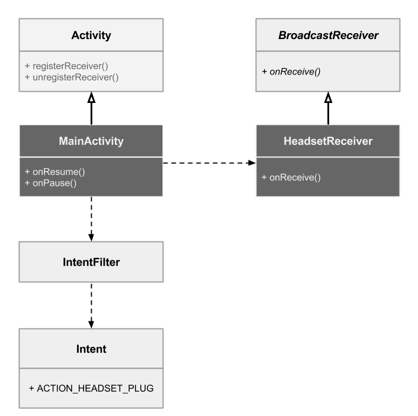

#### Simple Broadcast Receiver
Creates a Broadcast Receiver to receive ACTION_HEADSET_PLUG Intent, which is triggered when the headphone is plugged or unplugged.



##### 1. Create HeadsetReceiver
Extend the abstract class BroadcastReceiver and override onReceive(). We just pull the info from the Intent's extras.

```java
@Override
    public void onReceive(Context context, Intent intent) {
        Bundle b = intent.getExtras();
        Log.d(TAG, "Headset plugged");
        Log.d(TAG, "Plugged = " + b.getInt("state"));
        Log.d(TAG, "name = " + b.getString("name"));
        Log.d(TAG, "microphone = " + b.getInt("microphone"));

    }
```

##### 2. Register/Unregister receiver in Activity
```java
@Override
    public void onResume() {
        IntentFilter filter = new IntentFilter(Intent.ACTION_HEADSET_PLUG);
        registerReceiver(mReceiver, filter);
        super.onResume();
    }

    @Override public void onPause() {
        unregisterReceiver(mReceiver);
        super.onPause();
    }
```


