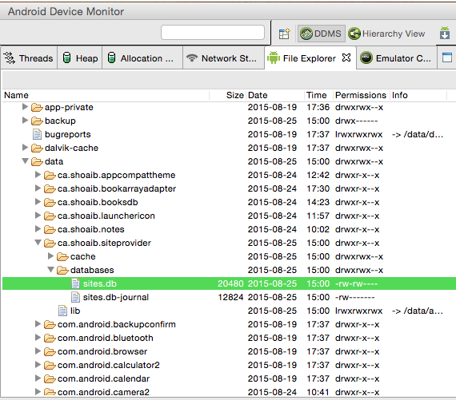
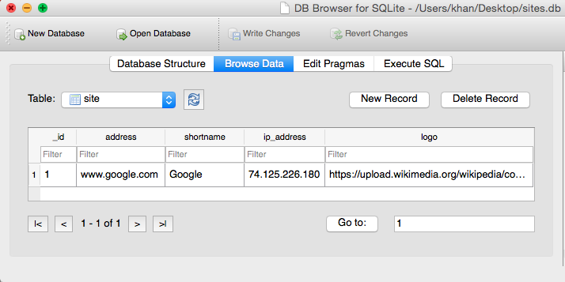

#### Exposing Database through Content Provider

We create a database containing information about websites - their url, name, ip address, logo. This could be useful for an app that stores data about websites.

##### 1. Create Database
###### 1a. Database Contract
The contract file contains the public interface to the database and content provider.

```java
public class SiteContract {

    public static final String CONTENT_AUTHORITY = "ca.shoaib.siteprovider.sites";
    public static final String BASE_PATH = "site";
    public static final Uri CONTENT_URI = Uri.parse("content://" + CONTENT_AUTHORITY + "/" + BASE_PATH);


    public static final class SiteEntry implements BaseColumns {
        // Table name
        public static final String TABLE_NAME = "site";
        public static final String COLUMN_ADDRESS = "address";
        public static final String COLUMN_SHORT_NAME = "shortname";
        public static final String COLUMN_IP_ADDRESS = "ip_address";
        public static final String COLUMN_LOGO_URL = "logo";
    }
}
```

###### 1b. Create DB Helper
Create the class which extends SQLiteOpenHelper. It contains code to create and upgrade the database, as well as constants such as database name, version etc.

```java
public class SiteDBHelper extends SQLiteOpenHelper {

    public static final String DATABASE_NAME = "sites.db";
    public static final int DATABASE_VERSION = 1;

    private static final String TABLE_CREATE = "CREATE TABLE " + SiteContract.SiteEntry.TABLE_NAME +
            " (" +
            SiteContract.SiteEntry._ID + " INTEGER PRIMARY KEY AUTOINCREMENT, " +
            SiteContract.SiteEntry.COLUMN_ADDRESS + " TEXT, " +
            SiteContract.SiteEntry.COLUMN_SHORT_NAME + " TEXT, " +
            SiteContract.SiteEntry.COLUMN_IP_ADDRESS + " TEXT" +
            SiteContract.SiteEntry.COLUMN_LOGO_URL + " TEXT" +
            ")";

    private static final String TABLE_UPGRADE = "DROP TABLE IF EXISTS " + SiteContract.SiteEntry.TABLE_NAME;

    public SiteDBHelper(Context context) {
        super(context, DATABASE_NAME, null, DATABASE_VERSION);
    }

    @Override
    public void onCreate(SQLiteDatabase db) {
        db.execSQL(TABLE_CREATE);
    }

    @Override
    public void onUpgrade(SQLiteDatabase db, int oldVersion, int newVersion) {
        db.execSQL(TABLE_UPGRADE);
    }
}
```

##### 2. Create Content Provider
###### 2a. Create Provider
Create SiteProvider class that extends ContentProvider. Add stubs for the methods inherited from ContentProvider.

i) Initialize OpenHelper (SiteDBHelper)

```java
private SiteDBHelper mOpenHelper;

    @Override
    public boolean onCreate() {
        mOpenHelper = new SiteDBHelper(getContext());
        return true;
    }
```

ii) Add Constants to Match Uri

```java
static final int SITE = 1;
static final int SITE_ID = 2;
```

iii) Create Static UriMatcher
```java
private static final UriMatcher sUriMatcher =
            new UriMatcher(UriMatcher.NO_MATCH);
    static {
        final String authority = SiteContract.CONTENT_AUTHORITY;
        final String base = SiteContract.BASE_PATH;
        sUriMatcher.addURI(authority, base, SITE);
        sUriMatcher.addURI(authority, base + "/#", SITE_ID);
    }
```

###### 2b. Register Provider
In AndroidManifest.xml file, add a <provider> tag and include the information about the newly created provider.

```xml
<provider
    android:authorities="ca.shoaib.siteprovider.sites"
    android:name=".SiteProvider"
    android:exported="false" />
```

###### 2c. Add CRUD Methods
Add query, insert, delete and update methods.

```java
@Override
    public Cursor query(Uri uri, String[] projection, String selection, String[] selectionArgs, String sortOrder) {
        return mOpenHelper.getReadableDatabase().query(
                SiteContract.SiteEntry.TABLE_NAME,
                SiteContract.SITE_TABLE_ALL_COLUMNS,
                selection,
                null,
                null,
                null,
                SiteContract.SiteEntry.COLUMN_SHORT_NAME + " DESC"
        );
    }

    @Override
    public Uri insert(Uri uri, ContentValues values) {
        long id = mOpenHelper.getWritableDatabase().insert(
                SiteContract.SiteEntry.TABLE_NAME,
                null,
                values);
        return Uri.parse(SiteContract.BASE_PATH + "/" + id);
    }

    @Override
    public int delete(Uri uri, String selection, String[] selectionArgs) {
        return mOpenHelper.getWritableDatabase().delete(
                SiteContract.SiteEntry.TABLE_NAME,
                selection,
                selectionArgs
        );
    }

    @Override
    public int update(Uri uri, ContentValues values, String selection, String[] selectionArgs) {
        return mOpenHelper.getWritableDatabase().update(
                SiteContract.SiteEntry.TABLE_NAME,
                values,
                selection,
                selectionArgs
        );
    }
```

###### 2d. Insert Data
In MainActivity.java, create and add a sample to the database

```java
ContentValues values = new ContentValues();
values.put(SiteContract.SiteEntry.COLUMN_ADDRESS, "www.google.com");
values.put(SiteContract.SiteEntry.COLUMN_SHORT_NAME, "Google");
values.put(SiteContract.SiteEntry.COLUMN_IP_ADDRESS, "74.125.226.180");
values.put(SiteContract.SiteEntry.COLUMN_LOGO_URL,
                "https://upload.wikimedia.org/wikipedia/commons/a/a0/Google_favicon_2012.jpg");

Uri siteUri = getContentResolver().insert(SiteContract.CONTENT_URI, values);
Log.d(TAG, "Inserted Site: " + siteUri.toString());
```

###### 2e. Check
Check if the data has been added by saving the database to the local machine through Android Device Monitor and opening the database using SQLiteBrowser.





